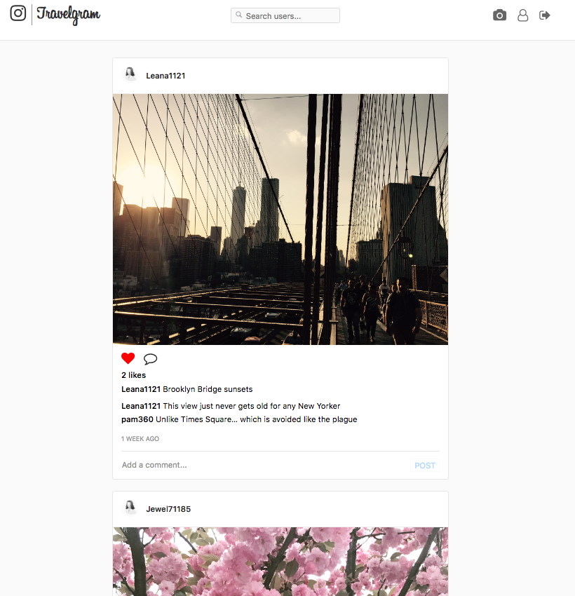
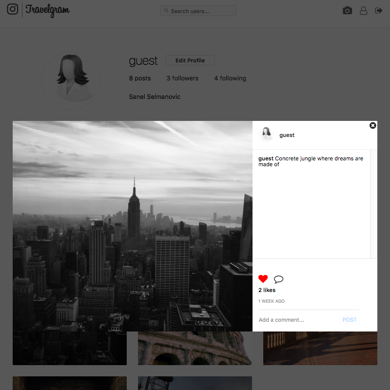

# Travelgram

[Travelgram][heroku]

[heroku]: http://www.travelgram.world/

Travelgram is a full-stack web application inspired by Instagram. It utilizes Ruby on Rails on the backend, a PostgreSQL database, and React.js with a Redux architectural framework on the frontend.

## Features & Implementation

### Secure User Authentication

Users can sign up and log in with validations in Rails' models to ensure that only valid data is saved to the database. Only registered users can access application features. Passwords are hashed using BCrypt.

### Posts Feed
Posts are stored in the database table, with columns for `id`, `user_id` that references the person who uploaded the post, `image` which is an attached file uploaded to AWS (Amazon Web Services). There is an optional column of `description` of a post. Once logged in, user is redirected to posts feed page and an AJAX call is made to the database and posts of the users that current user is following are fetched.

Each post on posts feed page has owner's profile picture, username, image, likes and comments associated to the post

Posts are created through update post form, where user can choose image and add a description to a post.
As a post requires a `user_id` column to be successfully saved, posts are always created through current user.

### Users
Users are stored in the database in a `users` table. User's show page displays their details and posts. Users can edit their own data and change profile photo.

### Search

As the user types in the search bar, a list of users matching the input are fetched from the database through an AJAX call.

### Likes and Comments
Users can like and unlike any post by clicking on the heart icon which color indicates action. Same action can be done with double click on the posts image.
User can post a comment by clicking on a cloud icon which gives focus to an input field and when user start typing comment can be submitted.
On the each post on the posts feed page, only last three comments are displayed by default. User can choose to see more comments by clicking on text `load more comments` which every time displays five more latest comments.

### Follows

User can follow and unfollow any other user.

## Future Directions for the Project

In addition to the features already implemented, I plan to continue work on this project.  The next steps for Travelgram are outlined below.
* [ ] Direct Messaging
* [ ] Hashtags
* [ ] Full responsiveness (optimization for mobile devices)
* [ ] Infinite scroll
